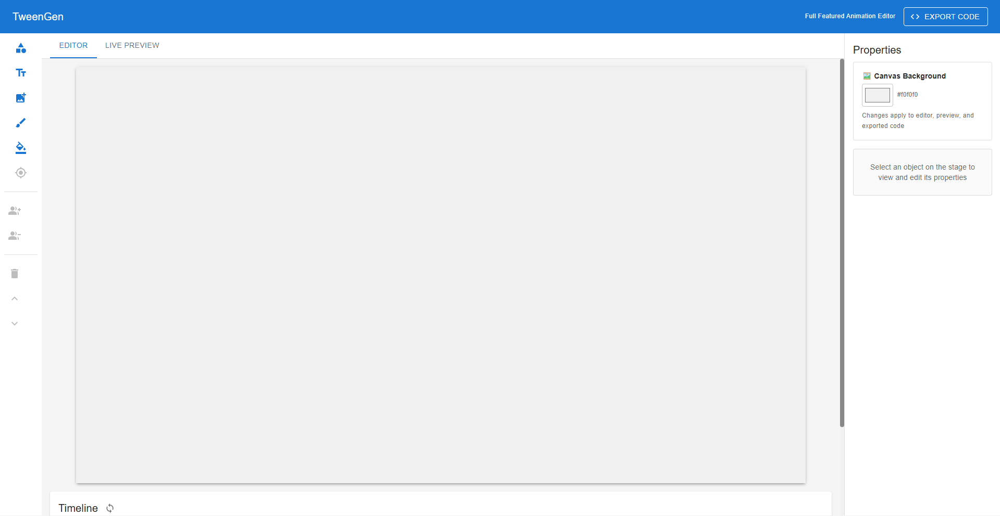

# TweenGen



> A powerful, browser-based animation editor that lets you create keyframe animations visually — then export them as production-ready standalone HTML/CSS/JavaScript code powered by GSAP.

---

## Demo

> **Live Demo:** [TweenGen](https://timeline-animation-tool-project.vercel.app/)

---

## Table of Contents

- [What It Does](#what-it-does)
- [Key Features](#key-features)
- [Technologies Used](#technologies-used)
- [Architecture Overview](#architecture-overview)
- [Project Structure](#project-structure)
- [How to Run Locally](#how-to-run-locally)
- [How to Use](#how-to-use)
- [How the Export Works](#how-the-export-works)
- [Technical Deep Dives](#technical-deep-dives)
- [Known Limitations](#known-limitations)
- [Future Improvements](#future-improvements)

---

## What It Does

The TweenGen is a **visual keyframe animation editor** built entirely in the browser. It allows users to:

1. **Create objects** on a canvas — rectangles, circles, ellipses, rounded rectangles, triangles, diamonds, pentagons, hexagons, stars, arrows, hearts, crosses, text, freehand drawings, and uploaded images.
2. **Set keyframes** at specific points on a timeline to define position, scale, rotation, opacity, and z-order.
3. **Preview animations** in real time using a GSAP-powered live preview that matches the final output exactly.
4. **Export animations** as three standalone files (`index.html`, `style.css`, `animation.js`) that can run in any modern browser with zero dependencies beyond a CDN-hosted GSAP library.

Think of it as a lightweight alternative to tools like Adobe Animate or After Effects, but designed specifically for web developers who need clean, exportable code.

---

## Key Features

| Feature | Description |
|---|---|
| **12 Shape Types** | Add rectangles, circles, ellipses, rounded rects, triangles, diamonds, pentagons, hexagons, stars, arrows, hearts, and crosses via a shape picker flyout. |
| **Text Objects** | Add editable text elements. Double-click to edit content. |
| **Image Upload** | Upload PNG, JPG, or other image files directly onto the canvas. Images are auto-scaled and fully animatable. |
| **Freehand Drawing** | Draw multi-stroke paths directly on the canvas with configurable color, stroke width, and curve smoothing. Press Enter to commit, Escape to cancel. |
| **Paint Bucket Fill** | MS Paint-style flood fill tool. Click inside any enclosed region of a drawing to fill it with color. Fills are embedded in the parent path and move with it during animation. |
| **Keyframe Timeline** | Place keyframes along a timeline scrubber. Each keyframe captures an object's full transform state including position, scale, rotation, opacity, and z-index. |
| **Multi-Select Keyframing** | Select multiple objects and click "Add Keyframe" to record all of them at once — critical for character animation where relative positions must stay in sync. |
| **Keyframe All** | One-click button to keyframe every object on the canvas at the current time. |
| **Easing Functions** | Per-keyframe easing — linear, ease-in/out/in-out (Quad, Cubic), bounce, and elastic. Right-click any keyframe diamond to change. |
| **Z-Index Animation** | Animate layer order between keyframes. Objects swap z-order mid-transition with a configurable swap point (0%–100% of the segment). |
| **Anchor Point Editing** | Drag a visual crosshair to set a custom rotation/scale pivot point for any object. Keyframes automatically adjust to prevent jumps. Double-click to reset to center. |
| **Live Preview** | A GSAP-driven preview panel that renders the animation identically to the exported code. Always loops for easy review. |
| **Code Export** | Generates complete, standalone HTML + CSS + JS files. Copy individual files or download all three at once. No build step required. |
| **Looping Playback** | Toggle loop mode for continuous animation playback during editing. Can be toggled during playback. Loop state carries into exported code. |
| **Track Management** | Lock tracks to prevent accidental edits. Hide tracks to declutter the timeline. Drag-and-drop to reorder tracks. Rename tracks by double-clicking. |
| **Layer Controls** | Bring objects forward or send them backward in the z-order. Sync track order from canvas or manually reorder. |
| **Object Grouping** | Select multiple objects and group them (Cmd/Ctrl+G). Ungroup with Cmd/Ctrl+Shift+G. Groups animate as a single unit. |
| **Fill & Stroke Color** | Edit fill color for shapes and text, or stroke color for paths, directly in the Properties Panel. |
| **Canvas Background** | Set a custom background color that applies to the editor, live preview, and exported code. |
| **Properties Panel** | Edit position, scale, rotation, and opacity numerically. Shows anchor point info when a custom pivot is set. |
| **Keyboard Shortcuts** | Delete with `Delete`/`Backspace`. Exit drawing mode with `Escape`. Commit drawing with `Enter`. Group with `Cmd/Ctrl+G`. Ungroup with `Cmd/Ctrl+Shift+G`. |

---

## Technologies Used

### Core Framework & Libraries

| Technology | Role |
|---|---|
| **React 18** | UI framework. Component-based architecture for the editor, canvas, timeline, and panels. |
| **Recoil** | Global state management. Manages shared state (canvas objects, keyframes, playback, drawing, tool modes) across deeply nested components without prop drilling. |
| **Fabric.js 7** | Interactive HTML5 canvas library. Handles object rendering, selection, dragging, scaling, rotation, polygon/path shapes, image objects, and freehand drawing on the editor canvas. |
| **GSAP 3** | Animation engine used in the Live Preview and in all exported code. Provides smooth, high-performance animations with easing support. |
| **Material UI (MUI) 7** | Component library providing the UI shell — panels, buttons, sliders, tabs, menus, dialogs, drawers, and tooltips. |

### Tooling & Build

| Technology | Role |
|---|---|
| **Vite 7** | Development server and build tool. Chosen for fast hot-module replacement during development. |
| **React Router 7** | Client-side routing (currently single-route, extensible for future pages). |

### Why These Choices?

- **Recoil over Redux/Zustand:** The animation editor has many interdependent state slices (selected object ↔ keyframes ↔ timeline position ↔ canvas render ↔ tool modes ↔ track visibility). Recoil's atom/selector model maps cleanly onto this without heavy boilerplate.
- **Fabric.js over raw Canvas API:** Fabric.js abstracts away hit-testing, selection handles, transforms, polygon rendering, and event handling — all critical for an interactive editor — while still giving access to the underlying canvas for custom operations like flood fill.
- **GSAP in exports:** GSAP is the industry standard for web animations. Using it in exports means the generated code is performant, well-supported, and familiar to any web developer.

---

## Architecture Overview

```
┌───────────────────────────────────────────────────────────────────────────────────┐
│  Header: TweenGen                              [<> EXPORT CODE]                   │
├─────────┬──────────────────────────────────────────────────┬──────────────────────┤
│         │          EDITOR  |  LIVE PREVIEW                 │                      │
│ Toolbar │──────────────────────────────────────────────────│  Properties Panel    │
│         │                                                  │                      │
│ • Shapes│   ┌──────────────────────────────────────┐       │  • X / Y             │
│ • Text  │   │                                      │       │  • Scale X / Y       │
│ • Image │   │         Fabric.js Canvas             │       │  • Rotation          │
│ • Draw  │   │         + Anchor Point Overlay       │       │  • Opacity           │
│ • Fill  │   │                                      │       │  • Fill Color        │
│ • Anchor│   └──────────────────────────────────────┘       │  • Stroke Color      │
│ • Group │                                                  │  • Canvas BG         │
│ • Delete│   ┌──────────────────────────────────────┐       │  • Drawing Opts      │
│ • Z-Ord │   │         Timeline Panel               │       │  • Paint Bucket      │
│         │   │  • Playback Controls                 │       │  • Anchor Point      │
│         │   │  • Scrubber                          │       │                      │
│         │   │  • Per-Object Tracks                 │       │                      │
│         │   │  • Keyframe Diamonds                 │       │                      │
│         │   │  • Lock / Hide / Reorder             │       │                      │
│         │   └──────────────────────────────────────┘       │                      │
├─────────┴──────────────────────────────────────────────────┴──────────────────────┤
│                                                                                   │
│  ┌─────────────────────────────────────────────────────────────────────────────┐  │
│  │                            Recoil State Layer                               │  │
│  │  canvasObjects │ keyframes    │ currentTime │ selectedObj  │ trackOrder     │  │
│  │  fabricCanvas  │ duration     │ isPlaying   │ drawingMode  │ lockedTracks   │  │
│  │  fillToolActive│ fillToolColor│ canvasBgColor│ loopPlayback│ hiddenTracks   │  │
│  └─────────────────────────────────────────────────────────────────────────────┘  │
│                                                                                   │
│  ┌─────────────────────────────────────────────────────────────────────────────┐  │
│  │                             Utility Modules                                 │  │
│  │  fabricHelpers.js │ interpolation.js │ codeGenerator.js │ shapeDefinitions  │  │
│  │  easing.js        │ floodFill.js     │                                      │  │
│  └─────────────────────────────────────────────────────────────────────────────┘  │
│                                                                                   │
└───────────────────────────────────────────────────────────────────────────────────┘
```

### Data Flow

```
User Action (drag, click, draw, fill)
        │
        ▼
  Fabric.js Canvas Event / Tool Handler
        │
        ▼
  Extract Properties (fabricHelpers.js)
        │  x, y, scaleX, scaleY, rotation, opacity, zIndex
        ▼
  Recoil State Update
        │  canvasObjects, keyframes, selectedObject, trackOrder
        ▼
  ┌─────────────────────┐     ┌──────────────────────────┐
  │  Editor Canvas      │     │  Live Preview            │
  │  (interpolation.js) │     │  (GSAP timeline)         │
  │  Lerp between KFs   │     │  Mirrors editor exactly  │
  │  Z-index reordering │     │  Z-swap at sync points   │
  └─────────────────────┘     └──────────────────────────┘
        │
        ▼ (on Export)
  Code Generator (codeGenerator.js)
        │
        ▼
  index.html + style.css + animation.js
```

---

## Project Structure

```
TweenGen/
│   
├── src/
│   ├── main.jsx                    # App entry point, Recoil + Router + MUI theme
│   ├── App.jsx                     # Route definitions
│   ├── App.css                     # Global styles
│   ├── index.css                   # CSS reset and base styles
│   │
│   ├── store/                      # Global state management (Recoil)
│   │   ├── atoms.jsx               # All state atoms (objects, keyframes, playback, drawing,
│   │   │                           #   anchor editing, locked/hidden tracks, fill tool, bg color)
│   │   ├── selectors.jsx           # Derived state (selected object details, keyframe counts)
│   │   └── hooks.jsx               # Custom hooks wrapping useRecoilState for each atom
│   │
│   ├── components/
│   │   ├── Layout/
│   │   │   ├── MainLayout.jsx      # Top-level layout: header, toolbar, tabs, properties panel
│   │   │   └── Header.jsx          # App bar with title and Export Code button
│   │   │
│   │   ├── Canvas/
│   │   │   ├── Canvas.jsx          # Fabric.js canvas — object creation, selection, drawing,
│   │   │   │                       #   interpolation, fill sync, z-index ordering, group support
│   │   │   └── AnchorPointOverlay.jsx # Visual crosshair overlay for anchor/pivot editing
│   │   │
│   │   ├── Timeline/
│   │   │   ├── Timeline.jsx        # Timeline container with track ordering, visibility management,
│   │   │   │                       #   drag-and-drop reorder, hidden tracks dropdown
│   │   │   ├── PlaybackControls.jsx# Play/pause/stop, loop toggle, keyframe nav, add keyframe,
│   │   │   │                       #   multi-select keyframing, keyframe all
│   │   │   ├── TimelineScrubber.jsx# Time slider
│   │   │   └── TimelineTrack.jsx   # Per-object track with keyframe diamonds, context menu
│   │   │                           #   (easing, z-swap point, delete), lock, hide, rename
│   │   │
│   │   ├── Toolbar/
│   │   │   ├── Toolbar.jsx         # Left sidebar: shape picker, text, image upload, drawing,
│   │   │   │                       #   paint bucket, anchor edit, group/ungroup, delete, z-order
│   │   │   ├── ShapePicker.jsx     # Popover flyout listing all 12 shape types with SVG previews
│   │   │   └── DrawingSettings.jsx # Color, stroke width, smoothing controls for drawing tool
│   │   │
│   │   ├── PropertiesPanel/
│   │   │   └── PropertiesPanel.jsx # Right sidebar: numeric property editors, fill/stroke color,
│   │   │                           #   canvas background, paint bucket settings, anchor info
│   │   │
│   │   └── CodeExport/
│   │       ├── CodeExportDialog.jsx# Modal showing generated code with copy/download per file
│   │       └── LivePreview.jsx     # GSAP-powered animation preview — supports all shape types,
│   │                               #   paths with embedded fills, images, groups, z-index animation
│   │
│   └── utils/                      # Pure utility functions (no React dependencies)
│       ├── fabricHelpers.js        # Create Fabric objects, extract properties, find by ID,
│       │                           #   compound path creation, group/ungroup, anchor point logic,
│       │                           #   custom rotation control rendering
│       ├── interpolation.js        # Keyframe interpolation with easing, rotation normalization,
│       │                           #   z-index step interpolation with global swap points,
│       │                           #   z-order canvas reordering
│       ├── easing.js               # Easing function implementations + GSAP name mapping
│       ├── floodFill.js            # Scanline flood fill algorithm for paint bucket tool
│       ├── shapeDefinitions.js     # Single source of truth for all 12 shape types — defines
│       │                           #   SVG paths, default colors, Fabric.js creation functions,
│       │                           #   and render mode (CSS vs SVG)
│       └── codeGenerator.js        # Generates HTML, CSS, JS strings from animation state —
│                                   #   supports all shapes, paths with fills, images, groups,
│                                   #   z-index animation, anchor points, canvas background
│
├── index.html
├── package.json
├── vite.config.js
└── README.md
```

---

## How to Run Locally

### Prerequisites

- **Node.js** v18 or higher
- **npm** v9 or higher

### Steps

```bash
# 1. Clone the repository
git clone <your-repo-url>
cd "TweenGen"

# 2. Install dependencies
npm install

# 3. Start the development server
npm run dev

# 4. Open in browser
# Navigate to http://localhost:5173
```

### Available Scripts

| Script | Description |
|---|---|
| `npm run dev` | Starts the Vite development server with hot reload |
| `npm run build` | Produces a production build in the `dist/` folder |

---

## How to Use

### 1. Adding Objects

Use the **left toolbar** to add objects to the canvas:

- **Shape Picker** — click the shapes icon to open a flyout with 12 shape options: Rectangle, Circle, Rounded Rect, Ellipse, Triangle, Diamond, Pentagon, Hexagon, Star, Arrow, Heart, and Cross. Each shows an SVG preview.
- **Text** — adds an editable text element (double-click to edit).
- **Image Upload** — opens a file picker to upload any image. Images are auto-scaled to fit the canvas and can be animated like any other object.
- **Drawing Tool (brush icon)** — enters freehand drawing mode. Draw multiple strokes, then press Enter to commit them as a single compound path. Press Escape to cancel. Configure color, stroke width, and smoothing in the Properties Panel.
- **Paint Bucket** — MS Paint-style flood fill. Click inside any enclosed region of a drawing to fill it with color. Fills move with their parent drawing during animation. Press Escape to exit.

### 2. Selecting & Moving Objects

Click any object on the canvas to select it. Drag to move, or use the corner handles to scale and rotate. The rotation handle is visually distinct (orange circle with an arrow hint) to differentiate it from the blue resize handles. All changes are reflected instantly in the Properties Panel on the right.

You can also click an object's **name in the timeline** to select it from the panel.

### 3. Setting Keyframes

1. Select an object on the canvas.
2. Move the **timeline scrubber** to the desired time.
3. Position/transform the object where you want it at that moment.
4. Click **Add Keyframe** in the playback controls.

Repeat at different times to create motion. The editor automatically interpolates between keyframes.

**Multi-select keyframing:** Select multiple objects (click + drag or Shift-click), then click "Add Keyframe" to record all of them at once. This is essential for character animation where you need to capture several body parts in the same pose simultaneously.

**Keyframe All:** Click "Keyframe All" to record every object on the canvas at the current time — perfect for setting up poses across an entire character rig.

### 4. Adjusting Easing

Right-click a **keyframe diamond** on any timeline track to open a context menu. Choose from:

- Linear
- Ease In / Out / In-Out (Quad, Cubic)
- Bounce
- Elastic

### 5. Z-Index Animation

Objects can change their layer order during animation. When two keyframes have different z-index values (because you moved layers between keyframing), the swap happens at a configurable point in the transition. Right-click a keyframe and use the "Z-Order Swap Point" submenu to control when the swap occurs (start, 25%, middle, 75%, or end of the segment).

### 6. Anchor Point Editing

Click the **anchor/crosshair icon** in the toolbar to enter anchor editing mode. A draggable crosshair appears on the selected object. Drag it to set a custom rotation and scale pivot point — useful for things like a swinging pendulum arm or a rotating wheel. Double-click the crosshair to reset to center. Existing keyframes automatically adjust their positions so the object doesn't jump.

### 7. Track Management

Each object gets a track row in the timeline. You can:

- **Lock** a track (lock icon) to prevent accidental keyframe edits
- **Hide** a track (eye icon) to declutter the timeline — hidden tracks appear in a dropdown menu
- **Reorder** tracks by dragging the grip handle
- **Rename** tracks by double-clicking the name
- **Sync** track order from canvas layer order using the sync button

### 8. Fill & Stroke Colors

Select a shape to edit its fill color in the Properties Panel. For path objects (drawings), you can edit the stroke color. Paint bucket fills are listed with color swatches and can be cleared individually.

### 9. Canvas Background

When no object is selected, the Properties Panel shows a canvas background color picker. This color applies to the editor canvas, the live preview, and the exported code.

### 10. Grouping

Select multiple objects and press **Cmd/Ctrl+G** to group them (or use the Group button in the toolbar). Groups animate as a single unit. Ungroup with **Cmd/Ctrl+Shift+G**.

### 11. Previewing

Click the **Live Preview** tab to see your animation play back using GSAP — this is the exact same engine and output as the exported code. The preview always loops for easy review.

### 12. Exporting

Click **Export Code** in the top-right header. A dialog shows the generated `HTML`, `CSS`, and `JavaScript` across tabs. You can:

- **Copy** individual files to clipboard
- **Download All** — saves `index.html`, `style.css`, and `animation.js` to your machine

Open `index.html` in any browser. No server or build step required.

---

## How the Export Works

This section explains the technical decisions behind code generation — useful context for interviews or code reviews.

### Shape Rendering Strategy

The exporter uses two rendering approaches depending on shape type:

- **CSS-rendered shapes** (rectangle, circle, rounded rect, ellipse, text): Created as styled `<div>` elements with CSS properties like `border-radius`, `background-color`, and `font-size`.
- **SVG-rendered shapes** (triangle, diamond, pentagon, hexagon, star, arrow, heart, cross): Created as `<div>` wrappers containing inline `<svg>` elements with `<path>` data. The SVG path coordinates are defined in a 0–100 viewBox coordinate space in `shapeDefinitions.js`.

### Coordinate System Translation

Fabric.js positions objects by their **center point** (or custom anchor point). CSS positions elements by their **top-left corner**. The exporter converts between these:

```
CSS left = Fabric left - (anchorX × element width)
CSS top  = Fabric top  - (anchorY × element height)
```

Where `anchorX` and `anchorY` default to 0.5 (center) unless a custom anchor point has been set.

### Freehand Path Export Strategy

Paths are the trickiest element to export correctly. The solution uses a **wrapper div + SVG** approach:

1. A wrapper `<div>` is positioned at the path's center point with zero width/height and `overflow: visible`.
2. Inside, an `<svg>` with a `<g>` transform translates the path data by the negative of the path offset (adjusted for any custom anchor point).
3. GSAP animates the wrapper div's position, scale, rotation, and opacity.
4. If paint bucket fills exist, they're added as `` elements inside the wrapper before the SVG, with their positions relative to the path's origin.

This avoids the need to recalculate or rewrite path coordinates on every keyframe.

### Z-Index Animation in Exports

When z-index changes between keyframes, the exporter generates `gsap.set()` calls at the calculated swap time to snap the `zIndex` CSS property. The swap point is computed globally across all objects to ensure synchronized layer changes.

### Image Export

Images are exported with their data URLs embedded directly in the generated JavaScript. The export creates `` elements with inline base64 `src` attributes.

### Easing Mapping

The app's internal easing names are mapped to GSAP equivalents at export time:

| Internal Name | GSAP Equivalent |
|---|---|
| `linear` | `none` |
| `easeInQuad` | `power1.in` |
| `easeOutQuad` | `power1.out` |
| `easeInOutQuad` | `power1.inOut` |
| `easeInCubic` | `power2.in` |
| `easeOutCubic` | `power2.out` |
| `easeInOutCubic` | `power2.inOut` |
| `easeInQuart` | `power3.in` |
| `easeOutQuart` | `power3.out` |
| `easeInOutQuart` | `power3.inOut` |
| `bounce` | `bounce.out` |
| `elastic` | `elastic.out` |

---

## Technical Deep Dives

### State Management with Recoil

The app uses **atoms** for each piece of state and **selectors** for derived data:

- `canvasObjectsState` — array of all objects on the canvas (id, type, name, fill, anchor point, path data, image data, children for groups, embedded fills)
- `keyframesState` — map of object ID → sorted array of keyframes, each containing time, properties (x, y, scaleX, scaleY, rotation, opacity, zIndex), easing type, and z-swap point
- `currentTimeState` — the current scrubber position in seconds
- `fabricCanvasState` — a direct reference to the Fabric.js canvas instance (marked `dangerouslyAllowMutability`)
- `trackOrderState` — explicit array of object IDs defining display and z-order
- `lockedTracksState` — plain object tracking which tracks are locked (not a Set, for Recoil reactivity)
- `hiddenTracksState` — plain object tracking which tracks are hidden in the timeline
- `fillToolActiveState` / `fillToolColorState` — paint bucket tool state
- `canvasBgColorState` — canvas background color
- `anchorEditModeState` — whether anchor editing mode is active

Selectors like `selectedObjectDetailsSelector` automatically recompute when their dependent atoms change, keeping the UI in sync without manual subscriptions.

### Interpolation Engine

Between two keyframes, every animatable property is interpolated using **linear interpolation (lerp)** with an optional easing function applied to the time factor `t`:

```
t_raw  = (currentTime - keyframeA.time) / (keyframeB.time - keyframeA.time)
t      = easingFunction(t_raw)
value  = lerp(keyframeA.value, keyframeB.value, t)
```

Rotation uses **shortest-path normalization** — angle deltas are clamped to [-180°, 180°] so objects always rotate the short way around.

Z-index uses **step interpolation** rather than lerp. It snaps from the before value to the after value at a configurable swap point (default 50% through the segment). A global swap point is computed across all objects to ensure synchronized layer changes.

### Drawing Tool & Path Smoothing

When smoothing is enabled, raw mouse points are converted into **quadratic Bézier curves** (`Q` commands in SVG path syntax) using midpoint interpolation between consecutive points. This produces smooth, natural-looking strokes instead of jagged line segments.

Multiple strokes are committed together as a single compound path, allowing complex multi-stroke drawings to be treated as one animatable object.

### Flood Fill Algorithm

The paint bucket tool uses a **scanline flood fill** algorithm for performance on the 1400×800 canvas:

1. The Fabric.js canvas is rendered to an offscreen bitmap (without selection handles).
2. Starting from the click point, the algorithm fills outward using scanline traversal — significantly faster than naive BFS for large regions.
3. The filled pixels are extracted into a trimmed PNG using an offscreen canvas.
4. The PNG is placed as a `fabric.Image` on the canvas, attached to the nearest parent path object, and positioned relative to it so it moves with the drawing during animation.

### Shape Definitions System

All 12 shape types are defined in a single source of truth (`shapeDefinitions.js`). Each definition includes:

- A display label and default fill color
- A render mode (`css` for div-based shapes, `svg` for path-based shapes)
- An SVG path string in a 0–100 coordinate space (used for the shape picker preview, live preview, and export)
- A factory function that creates the Fabric.js object

This system makes it straightforward to add new shapes — define the geometry once and it works everywhere.

---

## Known Limitations

- **Text editing** is done via a browser `prompt()` dialog (double-click text to edit). A dedicated inline text editor is planned.
- **Non-uniform scaling** (different scaleX and scaleY) is captured in keyframes but the live preview and export currently animate both axes. Full non-uniform scale export is a planned improvement.
- **No undo/redo** system is implemented yet.
- **Export does not support nested animations** or grouped objects with independent child animations — each group animates as a single unit.
- **Paint bucket fills** are raster-based (PNG), so they may show pixelation at high zoom or large scales.
- **Image export** embeds full base64 data URLs in the JavaScript file, which can make exports very large for high-resolution images.

---

## Future Improvements

- Undo / Redo system
- Audio track support (sync audio with animation timeline and include in exports)
- Inline text editing on canvas
- Object grouping with independent child animations
- Non-uniform scale in exports
- Color/fill animation (animate object color over time)
- Path morphing (animate one shape into another)
- Save / Load project files (JSON export of full animation state)
- Multiple canvases / scenes
- Onion skinning for frame-by-frame animation
- Audio track sync
- Keyframe curve editor (visual bezier easing)

---

## License

This project is licensed under the **MIT License**.

---

*Built as a portfolio project demonstrating React architecture, state management, canvas manipulation, animation engines, flood fill algorithms, and code generation.*